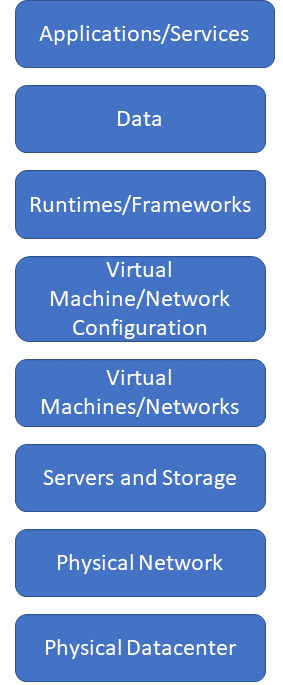
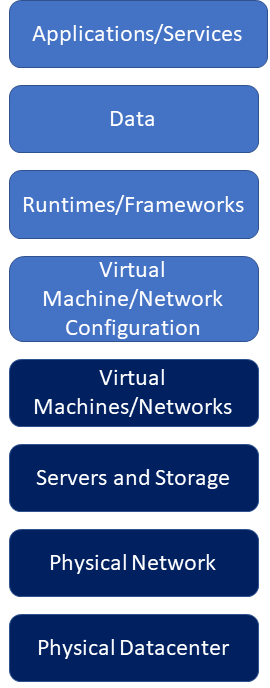
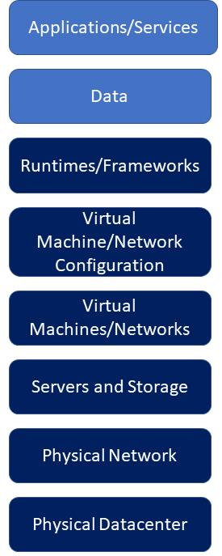
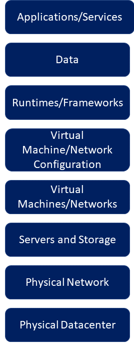

# Azure Compute: IaaS versus PaaS versus SaaS

In [how does Azure work?][what-is-azure], you learned that Azure is a collection of servers and networking hardware running virtualized hardware and software on behalf of users. There are three different *computing service models* that users can choose to utilize this virtualized hardware and software, and each of them are distinguished by the level of management responsibility assumed by a user. Management responsibility can mean a lot of different things depending on the type of resource, but commonly refers to creating, maintaining, or securing it.

To better understand this, let's break down a typical application or service into all of the hardware and software components necessary for it to run. We'll begin with what's necessary in an organization's **on-premises datacenter**.

At the bottom layer of the technology stack is the actual physical **datacenter**. This is the building that stores all of the organization's hardware such as **networking**, **storage**, and **servers**. While it may seem odd to include the physical building as part of technology stack, it's important to do so because it's one of the ways that an organization **trusts** that their networking, storage, and servers are **secure**.   

This trust is based on a pair of concepts. The first is **isolation** and refers to the security boundary around something. In the case of the physical building, it is isolated by the walls that surround it, and those walls form the security boundary. The second concept is **access control**, and refers to the act of deciding who or what has physical access to something. Again in the case of the building, there are designated entries and exits to the building and access into and out fo the building is controlled by a security guard or an employee ID badge scanner that opens a barrier.

These concepts are equally applicable to the physical network, servers, and storage with a few key differences. The physical network is isolated from physical tampering because it's inside the datacenter. However, the physical network is most likely connected to the external internet by a gateway. Like the entries and exits on the physical building, the gateway requires access control - such as a firewall - for it to be considered secure. 

Similarly, each server executes an operating system, and the operating system is isolated in that it can only be used either directly with a monitor, mouse, and keyboard, or remotely over the network. Access to the operating system is controlled by an access management service that challenges a user to provide a username and password, and the user must have an account with sufficient permission either stored in the operating system or provided by an identity service on the network. For the storage system, most mass storage systems are based on a server platform, so isolation and access control both work the same way.

This covers the physical infrastructure layers of the technology stack. As we move on to look at the layers that make up applications and services, next up are the **virtual machine** and **virtual network** layers. 

As you learned in ["how does Azure work?"][what-is-azure], virtualization is a technology that abstracts all the hardware instructions of a computer into software so they can be executed on a host. The benefit of virtualization is flexibility and ease of maintenance because it's easier to move a virtual machine description file and virtual hard drive from server to server than it is to try to recreate an exact physical computer configuration and host operating system from scratch on each physical machine.

Virtualization also applies to storage and networking. A **virtual network** uses a technology known as a **software defined network**, but it's similar to a virtual machine in that the physical network devices such as routers and switches are abstracted into software. Virtual storage is an abstraction of a physical storage device stored in on a physical drive. A virtual hard drive is an example of this.

Because both virtual machines and networks run as services on a computer, so they are isolated by security boundaries provided by the operating system and hardware of the computer. Access is controlled using the access management services of the operating system.

The next layer in the technology stack is virtual machine and network **configurations**. Virtual machine configurations are typically made up of a virtual machine definition that describes its virtual architecture as well as any other virtual hardware such as a virtual hard drive or a virtual network interface. Virtual network configurations typically define any mappings of physical network interfaces to virtual network interfaces as well as the virtual network topology. 

In most cases, these configurations are stored as files on the computer that runs the virtual machine or virtual network service. So, as with the virtual machine and network services, isolation is provided by the operating system and access is controlled by access management services.

Finally, the next three layers of the stack represent the actual code that runs as part of the application or service. First, any common **runtimes** or **frameworks** are typically installed on the virtual machines. Any **application data** is typically stored in a database running on a virtual machine or may be stored as files in virtual storage. Next, whatever user-written code for the application or service is executed.

As with the virtual machine and network services and their configurations, any runtimes, frameworks, databases, and application or service code are isolated by the operating system in which they execute. Access to the code is managed by the access management services of the operating system.

For each layer in this technology stack, it was the responsibility of the organization to create, secure, and maintain both the hardware and software that make up the application or service. When this stack is moved to the cloud, responsibility shifts to the cloud provider. The level of responsibility placed on the cloud provider determines the cloud model.

The first type of cloud model is known as **Infrastructure-as-a-Service (IaaS)**:

In this model, the cloud provider takes responsibility for creating, securing, and maintaining the physical datacenter, physical network, all servers and mass storage devices, virtual machine services and configuration files, and virtual network services. The user is responsible for creating, securing, and maintaining the virtual network configuration, any runtimes and frameworks, data storage, and application or service code.

Because the public cloud is a multitenant environment, the four bottom layers of the technology stack are shared by all customers of the cloud provider. The cloud provider implements security technology to provide isolation of each customers virtual machines and networking from that of every other customer. The cloud provider also provides access control for the creating, modification, and deletion of virtual machines and networks, but it's the responsibility of the customer to manage the identities and permissions of users to which they grant access. It's important to distinguish that the cloud provider provides access control only for its services - any access control and identity services that used by the customer's applications and services must be provided by the customer.

The next type of cloud model is **Platform-as-a-Service (PaaS)**:

In this model, the cloud provider takes responsibility for all layers in the technology stack except for the customer's application or service code and any non-platform data storage. In this model, as long as the cloud provider supports the runtimes or frameworks required by the customer's application or service code, the customer only has to take responsibility for their own code and data. As with IaaS, the cloud provider provides all isolation and access control for the underlying layers in the technology stack.

The last type of cloud model is **Software-as-a-Service (SaaS)** in which the cloud provider takes responsibility for all layers in the technology stack and provides access to the application or service:

In the on-premises model, the customer is able to trust that all the layers in the technology stack are properly isolated with sufficient access control because each layer has been procured by a trusted individual within the organization. However, in all three of the cloud models, the customer has to  **trust** that the cloud provider has provided as sufficient level of isolation and access control to all the lower layers in the technology in the stack.

However, in the case of IaaS, the customer typically extends their on-premises network to include a virtual network address space that's configured in the virtual networking service of the cloud provider. Maintaining trust and security across this divided responsibility brings a set of challenges that can be solved using a **trusted virtual datacenter extension approach**. 

## Next steps

Learn more about the **trusted virtual datacenter extension approach**.

<!-- links -->
[what-is-azure]: what-is-azure.md