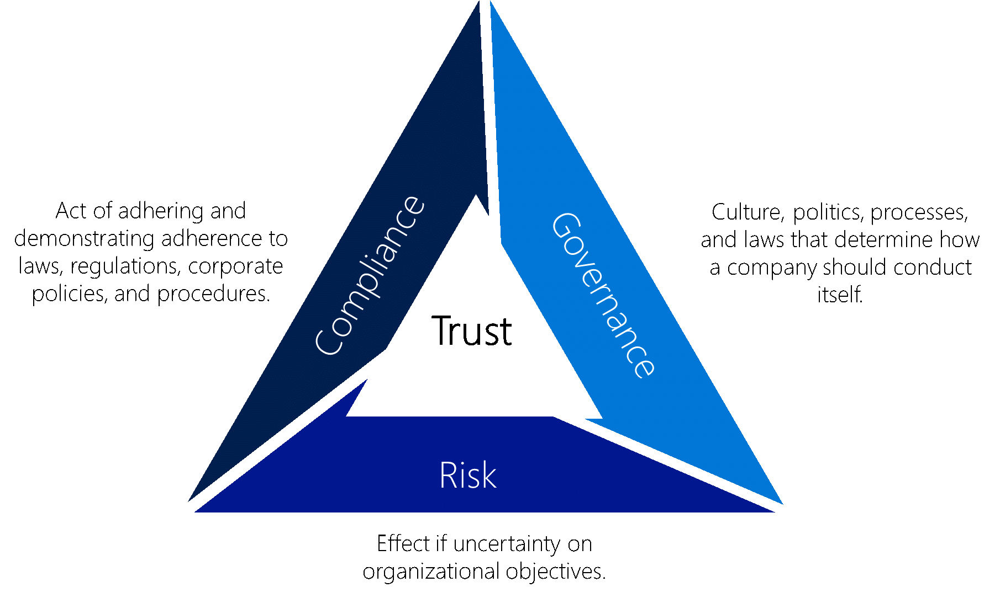

# Enterprise Cloud Adoption: Governance overview

This section of Azure enterprise cloud adoption covers the topic of *governance*. If you are new to the topic of goverance in Azure, you can begin with [what is cloud resource governance?](../getting-started/what-is-governance.md) and [resource access management in Azure](../getting-started/azure-resource-access.md) in the [getting started](../getting-started/overview.md) section.

## Actionable governance guidance in the Enterprise Cloud Adoption Framework

Currently, the scope of this framework limits the conversation to initial governance design when preparing to deploy a workload. If you are familiar with the concept of governance, this section covers [governance design for a simple workload](governance-single-team.md) and [governance design for multiple teams and multiple workloads](governance-multiple-teams.md). Both of these documents include an implementation guide.

## Governance position of the Enterprise Cloud Adoption Framework

Governance is a broadly used term. In the concept of governance in this framework focuses on the policies, management disciplines, and governance automation required to safely govern Cloud Adoption.

*Figure 1. Governance Disciplines.*

**Policy & Compliance:** The cloud offers many options for implementing management functions. However, a tool with no policy can have mixed results. When considering any governance strategy, it is wise to start with a corporate policy. In some cases, regulatory compliance will supercede corporate policy and require a set of more stringent guidelines. In either case, policies that reflect business risk and tolerance for risk are the root of any governance strategy.

**Management Disciplines:** This framework focuses on five core management disciplines which extend corporate policies into the cloud to support safe Cloud Adoption. Those disciplines include Cost Management, Security Management, Identity Management, Resource Management, and Configuration Management.

**Governance Automation:** Throughout ECA, governance automation is defined as the tools and approaches to logging, monitoring, notification, and automated enforcement of policy & compliance across operational management disciplines.

## Next steps

Once you have learned how to design and implement a governance model in Azure, you can move on to learn how to deploy an [infrastructure](../infrastructure/basic-workload.md) to Azure.

> [!div class="nextstepaction"]
> [Learn about resource access for a single team](governance-single-team.md)